# Agentic RAG + Eval Harness

<p align="center">
  
</p>

<p align="center"><sub>Visão geral. Diagramas detalhados (loop do Agente A, Agente B) em <a href="docs/architecture.md">docs/architecture.md</a>.</sub></p>

Sistema de RAG **agentic** (multi-agente) com **eval harness automatizado**, stack vendor-agnóstico
e orçamento de custo/latência. Reescrita pública e sanitizada de uma plataforma que projetei e
levei à produção (curadoria/geração de provas) na ESPM.

Inclui também um **estruturador de PDF multi-agente** (`src/agentic_rag/pdf/`): um probe
determinístico que entende o comportamento de cada PDF, mais dois agentes (chunking adaptativo
para RAG e extração de campos), com loop eval-driven. Ver [ADR 0004](docs/adr/0004-estruturador-pdf-probe-deterministico-loop-eval.md).

> Status: pipeline funcionando ponta a ponta. 69 testes verdes; estruturador de PDF validado
> ao vivo (indexação + busca filtrada no Qdrant); eval harness já rodado com LLM real e
> baseline versionado em `models/baseline_metrics.json` (ver [Resultados](#resultados)).

## Problema
Respostas de LLM sobre uma base de documentos precisam ser **fiéis, rastreáveis e baratas**.
RAG ingênuo (1 chamada) alucina e não dá pra auditar. Este projeto resolve com orquestração
de agentes (retrieve -> reason -> answer -> self-check), structured output e avaliação contínua
contra um baseline.

## Abordagem
- **RAG**: chunking + embeddings -> busca vetorial (Qdrant) com metadados.
- **Agente (loop de tool-use, SDK Anthropic)**: o modelo decide quando chamar a tool
  `search` (retrieve), depois responde com structured output e self-check de grounding.
  Portável a LangGraph se preciso de orquestração multi-nó.
- **LLM**: SDK oficial da Anthropic (Claude) por padrão; LiteLLM como escape hatch p/ outros providers.
- **Structured output (Pydantic)** e orçamento de **<= 2 chamadas de LLM por item**.
- **Eval harness**: faithfulness, answer relevance, context precision (juiz Claude nativo por
  padrão; ragas opt-in); promove o modelo SÓ se bater o baseline.

## Estruturador de PDF (multi-agente)
Recorte de PDF que **se adapta ao documento** em vez de chunking de tamanho fixo.

- **Probe determinístico** (`pdf/probe.py`): lê sinais de layout reais (fontes, blocos, tabelas,
  TOC, densidade) e deriva um `DocProfile` (tipo do PDF + estratégia de recorte recomendada).
  Roda antes de qualquer LLM.
- **Agente A - chunking adaptativo** (`pdf/chunk_agent.py`): loop **propor `CutPlan` -> cortar ->
  avaliar -> refinar** até atingir o recorte ideal. Score equilibra **cobertura** e **autocontido**
  (0.30 cada), mais integridade de fronteira, tamanho e coerência tópica.
- **Agente B - extração de campos** (`pdf/extract_agent.py`): extrai campos estruturados (Pydantic)
  com page grounding; loop de <= 2 chamadas (passada cheia -> 2a passada focada nos campos faltantes).

```bash
# chunking adaptativo (determinístico, sem custo)
python -m agentic_rag.pdf.cli documento.pdf --no-llm
# extração de campos
python -m agentic_rag.pdf.extract_cli doc.pdf --field "titulo=título" --required titulo --no-llm
```
`--no-llm` roda 100% determinístico (testável offline). Sem a flag, usa o loop com LLM (Claude).

## Ciclo de eval (gate de promoção)
O harness (`src/agentic_rag/evaluate.py`) fecha o ciclo **RAG + avaliação**: roda o sistema
sobre um conjunto dourado, pontua e só **promove** o novo estado se ele bater o baseline
versionado. É o mesmo princípio do loop do estruturador de PDF: mudança só entra se uma
métrica honesta a sustentar.

```
load_dataset ─► build_records ─► scorer ─► gate ─► [promote?]
 golden JSONL    roda o agente    faithfulness /   bate o    grava
 (pergunta +     por item         answer_rel /     baseline?  baseline
  ground_truth)  (answer+contexts) context_prec     (± tol)    versionado
```

- **Golden set** (`data/eval_set.jsonl`): uma pergunta por linha, com `ground_truth` de referência.
  ```json
  {"question": "Qual é o orçamento de chamadas de LLM por item?", "ground_truth": "No máximo 2..."}
  ```
- **Métricas**: `faithfulness`, `answer_relevancy`, `context_precision`.
- **Dois scorers atrás da mesma interface** (`Scorer`, injetável): o **default `llm_judge_score`**
  (juiz Claude nativo: structured output, 1 chamada/item, `grader_model`), que roda out-of-the-box
  no stack Anthropic-first, e **`ragas_score`** (opt-in via `run_eval(scorer=ragas_score)`, quando
  o ambiente ragas/langchain estiver compatível). Trocar o critério não mexe no gate.
- **Gate**: passa se **toda** métrica ≥ baseline − `eval_promotion_tolerance`. Na 1ª rodada (sem
  baseline) a referência é estabelecida. Promoção grava `models/baseline_metrics.json`; uma
  regressão bloqueia a promoção e **não** sobrescreve o baseline.

```bash
make eval   # roda o gate real (agente + juiz Claude) e promove o baseline se bater
```
Bordas pesadas/não-determinísticas (rodar o agente, pontuar) entram por injeção
(`answer_fn`, `scorer`), então o gate é testado offline sem tocar LLM/Qdrant/ragas
(ver `tests/test_evaluate.py`).

## Resultados
Baseline versionado atual (`models/baseline_metrics.json`), medido sobre os 17 itens do golden
set (`data/eval_set.jsonl`) com o juiz `claude-haiku-4-5`, 1 chamada de avaliação por item:

| Métrica | Valor |
|---|---|
| faithfulness (a resposta se sustenta no contexto recuperado) | **0.88** |
| answer relevancy (a resposta endereça a pergunta) | **0.82** |
| context precision (quanto do contexto recuperado é de fato útil) | **0.28** |

Leitura honesta: a **geração** está saudável (0.88 / 0.82); a **context precision de 0.28** é
baixa e está declarada de propósito, não escondida.

### O que essas métricas custaram pra virar confiáveis
A primeira rodada (golden de 3 perguntas) reportou o agente *perdendo* em context precision.
Uma verificação determinística derrubou o diagnóstico: para aquelas perguntas o agentic e o
RAG ingênuo recuperavam **o mesmo conjunto de contextos**, então a precisão verdadeira era
igual e a diferença observada (0.583 vs 0.4) era **ruído do juiz**, não regressão. O gargalo
não era o agente, era a metodologia de eval. O que mudou a partir daí ([ADR 0005](docs/adr/0005-eval-estabilizar-llm-judge-e-versionar-baseline.md)):

- **Juiz estabilizado**: temperatura 0.0, rubrica analítica em escala discreta de 3 pontos,
  rationale antes da nota, instruções anti-viés. Context precision saiu do juiz e passou a ser
  **computada deterministicamente** a partir de um booleano relevante/irrelevante por contexto.
- **Proveniência versionada**: o baseline grava `scorer` e `grader_model`; rodadas com
  proveniência diferente são tratadas como incomparáveis, pra troca de rubrica não se passar
  por ganho de modelo.
- **Golden set** de 3 para 17 itens (14 respondíveis + 3 adversariais), com corpus versionado.

### Por que a precisão continua em 0.28
Reranking com cross-encoder está implementado (`src/agentic_rag/rerank.py`, determinístico) e
foi para **A/B ao vivo** (top_k=5, n=17): **não rendeu**, deltas dentro do ruído. Causas
prováveis: corpus sintético pequeno demais (16 docs) para reranking ter o que reordenar, teto
estrutural de precisão e cross-encoder em inglês sobre corpus em português. Ficou **off por
padrão** em vez de ligado "porque parece sofisticado".

O aprendizado é o resultado: no corpus atual, melhoria de retrieval **não é mensurável**, então
o próximo gargalo real é um **corpus realista maior**, não mais componentes. Adicionar peça sem
sinal de medição é o erro que este projeto existe pra evitar.

Ainda não medidos: custo por consulta e p95 de latência.

## Arquitetura
Ver [`docs/architecture.md`](docs/architecture.md) (diagrama) e os ADRs em [`docs/adr/`](docs/adr/).

## Como rodar
```bash
make install          # instala deps + pre-commit
cp .env.example .env  # preencha as chaves
make test             # pytest
make run              # sobe a API (FastAPI) em :8000
make eval             # roda o eval harness (gate de promoção; ver "Ciclo de eval")
```
ou via Docker: `docker build -t agentic-rag . && docker run -p 8000:8000 agentic-rag`

## Stack
SDK Anthropic (Claude, tool-use) · Qdrant · SentenceTransformers · PyMuPDF (layout de PDF) ·
LiteLLM (escape hatch) · ragas (evals) · FastAPI · Pydantic · Docker · GitHub Actions (CI).

## Licença
MIT.
