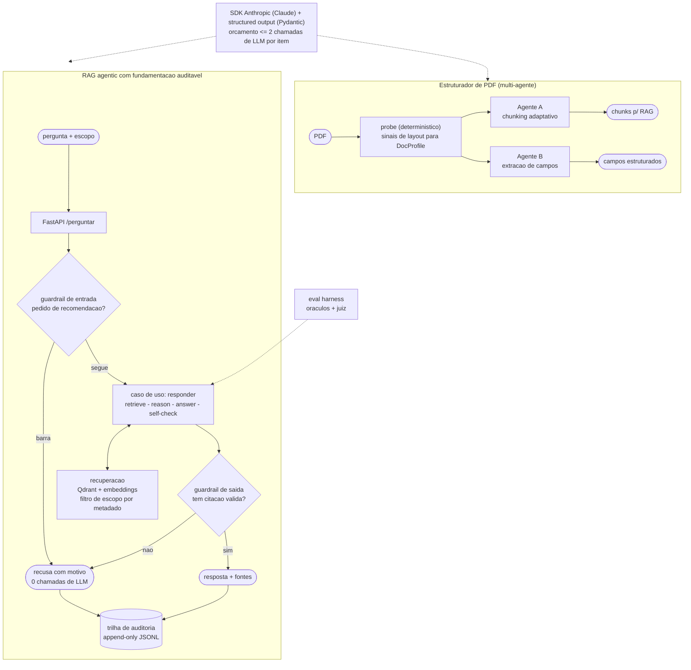
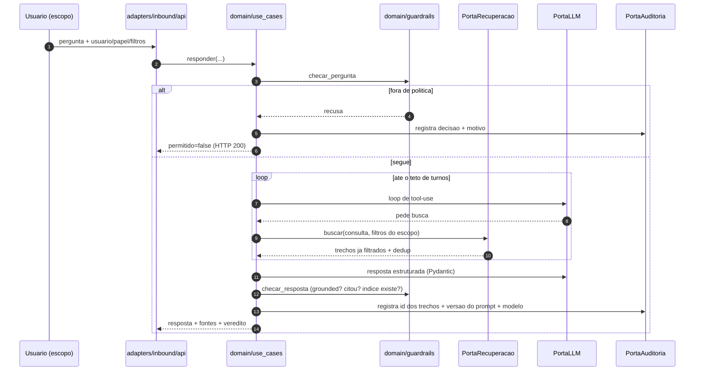
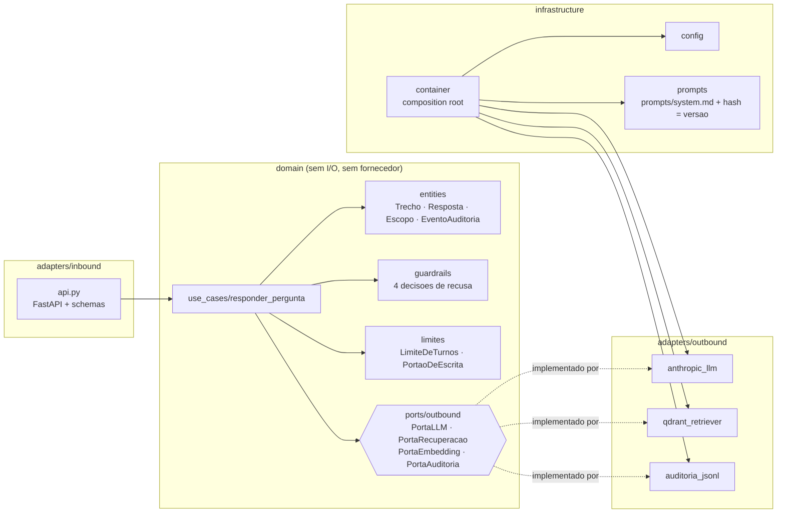
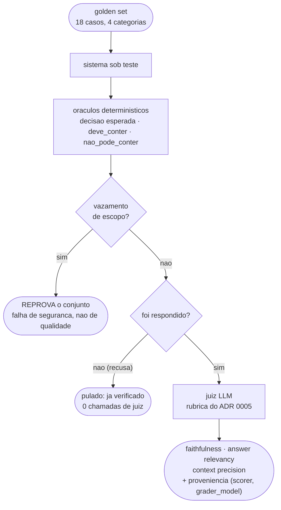
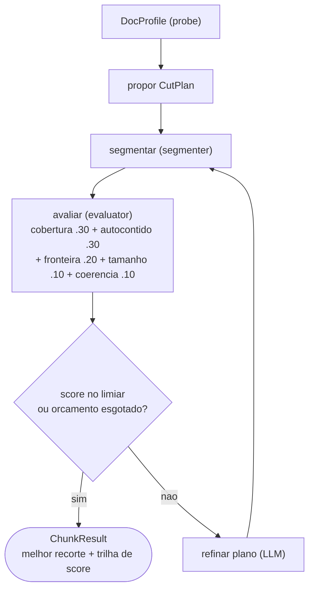
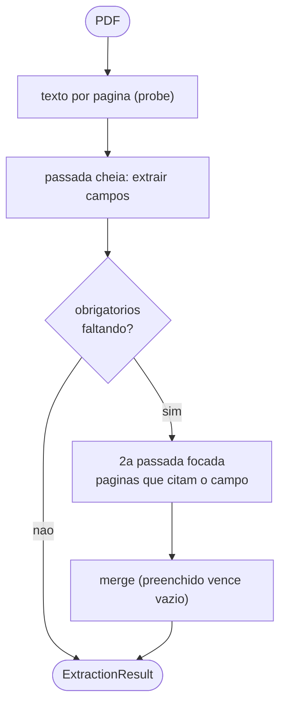

# Arquitetura

Diagramas em [Mermaid](https://mermaid.js.org) (renderizam direto no GitHub). Para exportar
SVG standalone, ver "Gerar SVG" no fim.

## Visao geral

Duas capacidades sobre o mesmo nucleo, e uma camada de garantia em volta das duas.



## Fluxo de uma pergunta (o que garante o que)

O ponto central: **o escopo restringe na recuperacao, nao por instrucao de prompt** — o trecho
fora do escopo nunca chega ao modelo. E **nenhuma resposta sai sem citacao valida**.



## Camadas (ports & adapters)

O dominio nao conhece fornecedor. Trocar Anthropic por outro provedor, ou Qdrant por outro
banco vetorial, e escrever um adapter — nenhum arquivo de `domain/` muda.



## Eval em duas camadas

O oraculo e barato, binario e estavel; o juiz e caro e ruidoso (ADR 0005). Por isso o juiz
roda **so no que foi respondido** — recusa ja foi verificada exatamente.



## Agente A: loop de chunking adaptativo



## Agente B: extracao de campos com 2 passadas



Decisoes em [`docs/adr/`](adr/). Principios: structured output (Pydantic), orcamento <=2
chamadas/item, deterministico-first, evals como gate de promocao, e **nenhuma alegacao sem
fonte rastreavel** (ver [`GOVERNANCA_IA.md`](GOVERNANCA_IA.md)).

## Gerar SVG (opcional)

**O Mermaid acima e a unica fonte de verdade** - inclusive no README, que passou a embutir o
diagrama inline em vez de apontar para um arquivo. Isso e deliberado: SVG exportado envelhece
em silencio, e foi o que aconteceu (`docs/diagrams/arch-*.svg`, gerados em 2026-06-30, ficaram
desenhando uma arquitetura que nao existe mais - sem guardrails, escopo nem trilha de
auditoria). Diagrama que precisa de passo manual para acompanhar o codigo acaba mentindo.

Se precisar de SVG standalone para slide ou site, gere na hora e trate como descartavel:

```bash
# requer Node (npx resolve sem instalar global)
npx -y -p @mermaid-js/mermaid-cli mmdc -i docs/architecture.md -o docs/diagrams/arch.svg
```

Na primeira execucao o mermaid-cli baixa um Chromium headless.
