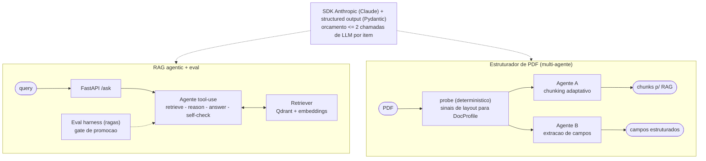

# Arquitetura

Diagramas em [Mermaid](https://mermaid.js.org) (renderizam direto no GitHub). Para exportar
SVG standalone, ver "Gerar SVG" no fim.

## Visao geral (duas capacidades, mesmos principios)



## Agente A: loop de chunking adaptativo


## Agente B: extracao de campos com 2 passadas


Decisoes em [`docs/adr/`](adr/). Principios: structured output (Pydantic), orcamento <=2
chamadas/item, deterministico-first, evals como gate de promocao.

## Gerar SVG (opcional)

Os diagramas acima ja renderizam no GitHub. Para exportar SVG standalone (ex.: slides, site):

```bash
# requer Node (npx resolve sem instalar global)
npx -y -p @mermaid-js/mermaid-cli mmdc -i docs/architecture.md -o docs/diagrams/arch.svg
```

Na primeira execucao o mermaid-cli baixa um Chromium headless. Saida em `docs/diagrams/`.
